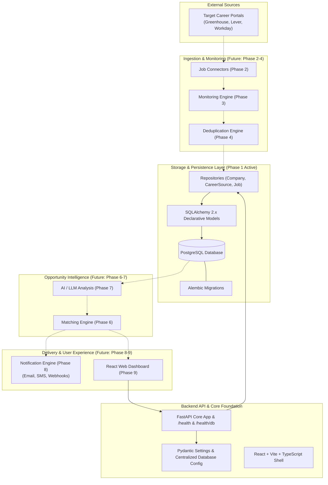

# JobWatch AI

> Automated Career Portal Monitoring & Opportunity Intelligence

---

## 1. Project Overview

**JobWatch AI** is an intelligent career opportunity-monitoring system engineered to bridge the gap between job seekers and company career portals. 

### The Problem
Searching for jobs manually across dozens of individual company career portals is repetitive, time-consuming, fragmented, and frustrating. High-demand openings often close within days, making it easy to miss high-value opportunities before aggregators index them.

### The Vision
JobWatch AI automates this workflow by directly monitoring career portals, detecting newly published positions within minutes, semantically parsing role requirements, matching them against personalized candidate profiles, and delivering multi-channel real-time notifications.

---

## 2. Current Status

```text
Current Phase: Phase 3 — Monitoring Engine
Status: Scheduled Monitoring Engine, Bounded Concurrency & Run Tracking Verified
```

Phase 3 introduces an automated, asynchronous monitoring engine that schedules periodic polling cycles across registered `CareerSource` records, orchestrates job ingestion via Phase 2 connectors, enforces system-wide concurrency limits and same-source overlap protection, isolates errors across sources, supports transient retry backoff, and records comprehensive execution history (`MonitoringRun`) in PostgreSQL.

---

## 3. Product Roadmap

- [x] **Phase 0** — Architecture & Project Setup *(Completed)*
- [x] **Phase 1** — Database + Backend Foundation *(Completed)*
- [x] **Phase 2** — Job Connectors *(Completed)*
- [x] **Phase 3** — Monitoring Engine *(Completed)*
- [ ] **Phase 4** — Deduplication
- [ ] **Phase 5** — User Profiles
- [ ] **Phase 6** — Matching Engine
- [ ] **Phase 7** — AI Intelligence
- [ ] **Phase 8** — Notifications
- [ ] **Phase 9** — Dashboard
- [ ] **Phase 10** — Application Tracking
- [ ] **Phase 11** — Reliability
- [ ] **Phase 12** — Production Deployment
- [ ] **Phase 13** — Advanced AI

---

## 4. System Architecture



---

## 5. Technology Stack

### Current (Phase 0 & Phase 1 Active)
- **Backend**: Python 3.13, FastAPI, Uvicorn, Pydantic v2, Pydantic Settings
- **Database & ORM**: PostgreSQL, SQLAlchemy 2.x (`DeclarativeBase`), psycopg 3 (`psycopg[binary]`)
- **Database Migrations**: Alembic
- **Frontend**: React 18, TypeScript, Vite
- **Testing**: PyTest, HTTPX (TestClient)
- **Containerization**: Docker, Docker Compose (PostgreSQL 16 Alpine + FastAPI)
- **Configuration**: Pydantic Settings (`.env.example` -> `.env`)

### Future (Planned Roadmap Phases)
- **Job Connectors & Scraping**: Playwright, Scrapy, BeautifulSoup, HTTP clients *(Phase 2)*
- **Queue / Scheduling**: Redis, Celery / ARQ *(Phase 3)*
- **Deduplication**: SimHash, MinHash, Vector Deduplication *(Phase 4)*
- **AI & NLP**: OpenAI / Anthropic APIs, LangChain / LlamaIndex, pgvector *(Phase 7, 13)*
- **Notifications**: SendGrid (Email), Twilio (SMS/WhatsApp), Webhooks *(Phase 8)*

---

## 6. Monorepo Structure

```text
jobwatch-ai/
├── backend/
│   ├── alembic/            # Database schema migration scripts & env.py
│   ├── alembic.ini         # Alembic configuration
│   ├── app/
│   │   ├── api/            # HTTP routes & controllers (v1 router)
│   │   ├── core/           # Config, database engine, pooling & sessionmaker
│   │   ├── models/         # SQLAlchemy 2.x ORM models (Company, CareerSource, Job)
│   │   ├── schemas/        # Pydantic v2 request/response validation schemas
│   │   ├── services/       # Domain business logic (Phase 2+)
│   │   ├── repositories/   # Data access repositories (Company, CareerSource, Job)
│   │   ├── workers/        # Background execution (Phase 3)
│   │   ├── connectors/     # Career portal integrations (Phase 2)
│   │   ├── ai/             # LLM orchestration (Phase 7)
│   │   ├── notifications/  # Notification providers (Phase 8)
│   │   └── main.py         # FastAPI application entrypoint
│   ├── tests/              # Pytest test suite (20 passing tests)
│   ├── requirements.txt    # Phase 0 & Phase 1 Python dependencies
│   └── Dockerfile          # Backend container specification
│
├── frontend/
│   ├── src/
│   │   ├── components/     # Reusable UI components
│   │   ├── pages/          # Top-level page views
│   │   ├── layouts/        # Application layouts
│   │   ├── hooks/          # Reusable custom hooks
│   │   ├── services/       # API communication client (with health & db probe)
│   │   ├── stores/         # State management stores
│   │   ├── types/          # TypeScript interfaces
│   │   ├── App.tsx         # Root component shell
│   │   └── main.tsx        # React entrypoint
│   └── package.json
│
├── docs/                   # Architectural, database & development docs
├── scripts/                # Automated cross-platform setup scripts
├── docker-compose.yml      # Local container orchestration (PostgreSQL + FastAPI)
├── .env.example            # Environment variables template
├── .gitignore              # Monorepo git exclusion rules
└── README.md               # Comprehensive project overview & roadmap
```

---

## 7. Local Development

### 1. Configure Environment
```bash
# Windows
copy .env.example .env

# macOS / Linux
cp .env.example .env
```

### 2. Start PostgreSQL
```bash
docker compose up -d postgres
```

### 3. Backend Setup & Startup
```bash
# Setup virtual environment
python -m venv .venv
.venv\Scripts\activate       # On macOS/Linux: source .venv/bin/activate

# Install dependencies
pip install -r backend/requirements.txt

# Run database migrations
.venv\Scripts\python -m alembic -c backend/alembic.ini upgrade head

# Run backend test suite
.venv\Scripts\python -m pytest backend/tests

# Start FastAPI server
uvicorn app.main:app --app-dir backend --port 8000 --reload
```

Verify backend and database readiness:
```bash
curl http://localhost:8000/health
curl http://localhost:8000/api/v1/health/db
```

### 4. Frontend Setup & Startup
```bash
cd frontend
npm install
npm run build
npm run dev
```

Visit the frontend at: `http://localhost:5173`

---

## 8. Documentation

- [Architecture Specification](docs/architecture.md)
- [Connectors Specification](docs/connectors.md)
- [Monitoring Engine Specification](docs/monitoring.md)
- [Database Specification](docs/database.md)
- [Development Guide](docs/development.md)
