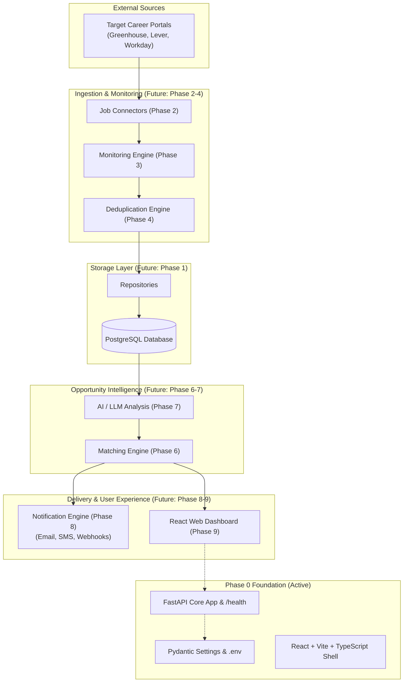

# JobWatch AI

> Automated Career Portal Monitoring & Opportunity Intelligence

---

## 1. Project Overview

**JobWatch AI** is an intelligent career opportunity-monitoring system engineered to bridge the gap between job seekers and company career portals. 

### The Problem
Searching for jobs manually across dozens of individual company career portals is repetitive, time-consuming, fragmented, and frustrating. High-demand openings often close within days, making it easy to miss high-value opportunities before aggregators index them.

### The Vision
JobWatch AI automates this workflow by directly monitoring career portals, detecting newly published positions within minutes, semantically parsing role requirements, matching them against personalized candidate profiles, and delivering multi-channel real-time notifications.

---

## 2. Current Status

```text
Current Phase: Phase 0 — Architecture & Project Setup
Status: Foundation Established & Validated
```

Phase 0 establishes a clean, scalable monorepo structure, architectural boundaries, configuration management, minimal backend and frontend shells, and containerization scaffolding. No future-phase business logic is implemented yet.

---

## 3. Product Roadmap

- [x] **Phase 0** — Architecture & Project Setup *(Current)*
- [ ] **Phase 1** — Database + Backend Foundation
- [ ] **Phase 2** — Job Connectors
- [ ] **Phase 3** — Monitoring Engine
- [ ] **Phase 4** — Deduplication
- [ ] **Phase 5** — User Profiles
- [ ] **Phase 6** — Matching Engine
- [ ] **Phase 7** — AI Intelligence
- [ ] **Phase 8** — Notifications
- [ ] **Phase 9** — Dashboard
- [ ] **Phase 10** — Application Tracking
- [ ] **Phase 11** — Reliability
- [ ] **Phase 12** — Production Deployment
- [ ] **Phase 13** — Advanced AI

---

## 4. System Architecture



---

## 5. Technology Stack

### Current (Phase 0 Active)
- **Backend**: Python 3.13, FastAPI, Uvicorn, Pydantic v2, Pydantic Settings
- **Frontend**: React 18, TypeScript, Vite
- **Testing**: PyTest, HTTPX (TestClient)
- **Containerization**: Docker, Docker Compose
- **Configuration**: Dotenv (`.env.example`)

### Future (Planned Phases)
- **Database**: PostgreSQL, SQLAlchemy, Alembic *(Phase 1)*
- **Job Connectors & Scraping**: Playwright, Scrapy, BeautifulSoup, HTTP clients *(Phase 2)*
- **Queue / Scheduling**: Redis, Celery / ARQ *(Phase 3)*
- **Deduplication**: SimHash, MinHash, Vector Deduplication *(Phase 4)*
- **AI & NLP**: OpenAI / Anthropic APIs, LangChain / LlamaIndex, pgvector *(Phase 7, 13)*
- **Notifications**: SendGrid (Email), Twilio (SMS/WhatsApp), Webhooks *(Phase 8)*

---

## 6. Monorepo Structure

```text
jobwatch-ai/
├── backend/
│   ├── app/
│   │   ├── api/            # HTTP routes & controllers (v1 router)
│   │   ├── core/           # Settings & configuration (Pydantic Settings)
│   │   ├── models/         # Database models (Phase 1)
│   │   ├── schemas/        # Request/response validation schemas
│   │   ├── services/       # Domain business logic (Phase 2+)
│   │   ├── repositories/   # Data access layer (Phase 1)
│   │   ├── workers/        # Background execution (Phase 3)
│   │   ├── connectors/     # Career portal integrations (Phase 2)
│   │   ├── ai/             # LLM orchestration (Phase 7)
│   │   ├── notifications/  # Notification providers (Phase 8)
│   │   └── main.py         # FastAPI application entrypoint
│   ├── tests/              # Pytest test suite
│   ├── requirements.txt    # Minimal Phase 0 dependencies
│   └── Dockerfile          # Backend container specification
│
├── frontend/
│   ├── src/
│   │   ├── components/     # Reusable UI components
│   │   ├── pages/          # Top-level page views
│   │   ├── layouts/        # Application layouts
│   │   ├── hooks/          # Reusable custom hooks
│   │   ├── services/       # API communication client
│   │   ├── stores/         # State management stores
│   │   ├── types/          # TypeScript interfaces
│   │   ├── App.tsx         # Root component shell
│   │   └── main.tsx        # React entrypoint
│   └── package.json
│
├── docs/                   # Architectural & development documentation
├── scripts/                # Automated cross-platform setup scripts
├── docker-compose.yml      # Local container orchestration
├── .env.example            # Environment variables template
├── .gitignore              # Monorepo git exclusion rules
└── README.md
```

---

## 7. Local Development

### 1. Configure Environment
```bash
# Windows
copy .env.example .env

# macOS / Linux
cp .env.example .env
```

### 2. Backend Setup & Startup
```bash
# Setup virtual environment
python -m venv .venv
.venv\Scripts\activate       # On macOS/Linux: source .venv/bin/activate

# Install dependencies
pip install -r backend/requirements.txt

# Run test suite
python -m pytest backend/tests

# Start FastAPI server
uvicorn app.main:app --app-dir backend --port 8000 --reload
```

Verify backend health:
```bash
curl http://localhost:8000/health
```

Expected response:
```json
{
  "status": "healthy",
  "app_name": "JobWatch AI",
  "version": "0.1.0",
  "environment": "development",
  "timestamp": "2026-09-15T16:00:00.000Z"
}
```

### 3. Frontend Setup & Startup
```bash
cd frontend
npm install
npm run build
npm run dev
```

Visit the frontend at: `http://localhost:5173`

### 4. Running with Docker Compose
```bash
docker compose up --build
```
Access the health endpoint at `http://localhost:8000/health`.

---

## 8. Documentation

- [Architecture Specification](file:///c:/Users/ashwi/Documents/Main%20Projects/JobWatch%20AI/docs/architecture.md)
- [Development Guide](file:///c:/Users/ashwi/Documents/Main%20Projects/JobWatch%20AI/docs/development.md)
