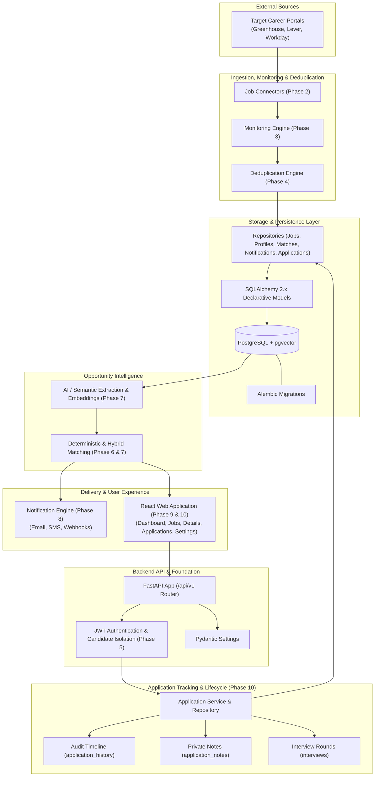

# JobWatch AI

> Automated Career Portal Monitoring & Opportunity Intelligence

---

## 1. Project Overview

**JobWatch AI** is an intelligent career opportunity-monitoring system engineered to bridge the gap between job seekers and company career portals. 

### The Problem
Searching for jobs manually across dozens of individual company career portals is repetitive, time-consuming, fragmented, and frustrating. High-demand openings often close within days, making it easy to miss high-value opportunities before aggregators index them.

### The Vision
JobWatch AI automates this workflow by directly monitoring career portals, detecting newly published positions within minutes, semantically parsing role requirements, matching them against personalized candidate profiles, and delivering multi-channel real-time notifications.

---

## 2. Current Status

```text
Current Phase: Phase 11 — Reliability, Observability & Production Hardening
Status: Complete — Hardened configuration, fail-fast production validation, request correlation IDs, structured logging & redaction, defensive security headers, in-memory rate limiting, dedicated liveness/readiness probes, application telemetry metrics, database connection pooling resilience, graceful shutdown, and React error boundaries.
```

Phase 11 makes JobWatch AI resilient, observable, secure, and operationally safe under real-world conditions without introducing new product features or prematurely deploying cloud infrastructure.

---

## 3. Product Roadmap

- [x] **Phase 0** — Architecture & Project Setup *(Completed)*
- [x] **Phase 1** — Database + Backend Foundation *(Completed)*
- [x] **Phase 2** — Job Connectors *(Completed)*
- [x] **Phase 3** — Monitoring Engine *(Completed)*
- [x] **Phase 4** — Deduplication *(Completed)*
- [x] **Phase 5** — User Profiles *(Completed)*
- [x] **Phase 6** — Matching Engine *(Completed)*
- [x] **Phase 7** — AI Intelligence *(Completed)*
- [x] **Phase 8** — Notifications *(Completed)*
- [x] **Phase 9** — Candidate Dashboard & Job Discovery UI *(Completed)*
- [x] **Phase 10** — Application Tracking & Application Lifecycle *(Completed)*
- [x] **Phase 11** — Reliability & Production Hardening *(Completed)*
- [ ] **Phase 12** — Production Deployment
- [ ] **Phase 13** — Advanced AI

---

## 4. System Architecture


```mermaid
flowchart TD
    subgraph External["External Sources"]
        CP["Target Career Portals<br/>(Greenhouse, Lever, Workday)"]
    end

    subgraph DataIngestion["Ingestion, Monitoring & Deduplication"]
        JC["Job Connectors (Phase 2)"]
        ME["Monitoring Engine (Phase 3)"]
        DD["Deduplication Engine (Phase 4)"]
    end

    subgraph Persistence["Storage & Persistence Layer"]
        DB[(PostgreSQL + pgvector)]
        ALEMBIC["Alembic Migrations"]
        REPO["Repositories (Jobs, Profiles, Matches, Notifications, Applications)"]
        ORM["SQLAlchemy 2.x Declarative Models"]
        DB --- ALEMBIC
        REPO --> ORM
        ORM --> DB
    end

    subgraph Intelligence["Opportunity Intelligence"]
        AI["AI / Semantic Extraction & Embeddings (Phase 7)"]
        MATCH["Deterministic & Hybrid Matching (Phase 6 & 7)"]
    end

    subgraph Tracking["Application Tracking & Lifecycle (Phase 10)"]
        APP["Application Service & Repository"]
        HIST["Audit Timeline (application_history)"]
        NOTES["Private Notes (application_notes)"]
        INTS["Interview Rounds (interviews)"]
    end

    subgraph Delivery["Delivery & User Experience"]
        NOTIF["Notification Engine (Phase 8)<br/>(Email, SMS, Webhooks)"]
        UI["React Web Application (Phase 9 & 10)<br/>(Dashboard, Jobs, Details, Applications, Settings)"]
    end

    subgraph CoreBackend["Backend API & Foundation"]
        API["FastAPI App (/api/v1 Router)"]
        AUTH["JWT Authentication & Candidate Isolation (Phase 5)"]
        CONF["Pydantic Settings"]
    end

    CP --> JC
    JC --> ME
    ME --> DD
    DD --> REPO
    DB --> AI
    AI --> MATCH
    MATCH --> NOTIF
    MATCH --> UI
    UI --> API
    API --> AUTH
    AUTH --> APP
    APP --> HIST
    APP --> NOTES
    APP --> INTS
    APP --> REPO
    API --> CONF
```

---

## 5. Technology Stack

### Active Core Technologies (Phases 0–10)
- **Backend Framework**: Python 3.13, FastAPI, Uvicorn, Pydantic v2, Pydantic Settings
- **Database & Storage**: PostgreSQL 16 (`pgvector/pgvector:pg16`), SQLAlchemy 2.x (`DeclarativeBase`), psycopg 3 (`psycopg[binary]`)
- **Database Migrations**: Alembic (9 migration revisions through `0009_application_tracking`)
- **Connectors & Ingestion**: Greenhouse, Lever, Workday normalized ingestion pipelines
- **Monitoring & Workers**: Background monitoring daemon, health probes, retry policies
- **Deduplication Engine**: Canonical job consolidation, composite fingerprinting, title normalization
- **Candidate Domain & Auth**: JWT authentication (bcrypt), candidate profiles, skill matrices, preferences
- **Matching Intelligence**: Deterministic rule-based matching engine + AI hybrid semantic embeddings (`text-embedding-3-small`, OpenAI LLM explanations)
- **Notifications & Alerting**: Multi-channel dispatch (Email templates, SSRF-protected Webhooks), candidate alerting preferences, deduplication and quiet-hours rate limiting
- **Application Tracking & Lifecycle**: Controlled lifecycle statuses (`APPLIED` to `ACCEPTED`), transition validation, immutable audit timeline, candidate private notes, scheduled interview management
- **Frontend Architecture**: React 18, TypeScript, Vite, CSS design system tokens (dark mode, glassmorphism, micro-animations), Lucide React icons, DOMPurify
- **Testing & Quality**: 
  - Backend: PyTest (274 tests passing, 100% test pass rate)
  - Frontend: Vitest + React Testing Library (31 tests passing, 100% test pass rate)
- **Containerization**: Docker, Docker Compose (PostgreSQL 16 Alpine + FastAPI)

---

## 6. Monorepo Structure

```text
jobwatch-ai/
├── backend/
│   ├── alembic/            # Database schema migration scripts & env.py (Revisions 0001-0009)
│   ├── alembic.ini         # Alembic configuration
│   ├── app/
│   │   ├── api/            # HTTP routes & controllers (Auth, Jobs, Applications, Profile, etc.)
│   │   ├── core/           # Config, database engine, pooling & sessionmaker
│   │   ├── models/         # SQLAlchemy 2.x models (Job, Application, Profile, Match, etc.)
│   │   ├── schemas/        # Pydantic v2 request/response validation schemas
│   │   ├── services/       # Domain business logic (ApplicationService, ProfileService, etc.)
│   │   ├── repositories/   # Clean data access layer (Application, Job, Match, Note, Interview)
│   │   ├── workers/        # Background execution & monitoring workers
│   │   ├── connectors/     # Greenhouse, Lever, Workday integrations
│   │   ├── ai/             # AI extraction, embeddings & LLM explanations
│   │   ├── notifications/  # Notification providers, channels & dispatchers
│   │   └── main.py         # FastAPI application entrypoint
│   ├── tests/              # Comprehensive Pytest test suite (274 tests)
│   ├── requirements.txt    # Python dependencies
│   └── Dockerfile          # Backend container specification
│
├── frontend/
│   ├── src/
│   │   ├── components/     # UI components (applications, jobs, matching, common, layout)
│   │   ├── context/        # React Context providers (AuthContext)
│   │   ├── pages/          # Top-level page views (Dashboard, Jobs, Applications, Profile, etc.)
│   │   ├── layouts/        # Application layouts (AppLayout, ProtectedRoute)
│   │   ├── hooks/          # Reusable custom hooks
│   │   ├── services/       # API clients (applications, jobs, notifications, auth, profile)
│   │   ├── test/           # Vitest unit & integration test suites (31 tests)
│   │   ├── types/          # TypeScript interfaces (application, job, profile, notif)
│   │   ├── index.css       # Comprehensive CSS design tokens and component styling
│   │   ├── App.tsx         # Root component with routing table
│   │   └── main.tsx        # React entrypoint
│   └── package.json
│
├── docs/                   # Architectural, database & development specifications
├── scripts/                # Automated cross-platform setup scripts
├── docker-compose.yml      # Local container orchestration (PostgreSQL + FastAPI)
├── .env.example            # Environment variables template
├── .gitignore              # Monorepo git exclusion rules
└── README.md               # Comprehensive project overview & roadmap
```

---

## 7. Local Development

### 1. Configure Environment
```bash
# Windows
copy .env.example .env

# macOS / Linux
cp .env.example .env
```

### 2. Start PostgreSQL
```bash
docker compose up -d postgres
```

### 3. Backend Setup & Startup
```bash
# Setup virtual environment
python -m venv .venv
.venv\Scripts\activate       # On macOS/Linux: source .venv/bin/activate

# Install dependencies
pip install -r backend/requirements.txt

# Run database migrations
.venv\Scripts\python -m alembic -c backend/alembic.ini upgrade head

# Run backend test suite
.venv\Scripts\python -m pytest backend/tests

# Start FastAPI server
uvicorn app.main:app --app-dir backend --port 8000 --reload
```

Verify backend and database readiness:
```bash
curl http://localhost:8000/health
curl http://localhost:8000/api/v1/health/db
```

### 4. Frontend Setup & Startup
```bash
cd frontend
npm install
npm test            # Run Vitest unit & integration test suite (31 tests)
npm run build       # Verify TypeScript compilation & Vite bundle
npm run dev         # Start local development server
```

Visit the frontend at: `http://localhost:5173`

---

## 8. Documentation

- [Architecture Specification](docs/architecture.md)
- [Connectors Specification](docs/connectors.md)
- [Monitoring Engine Specification](docs/monitoring.md)
- [Deduplication Specification](docs/deduplication.md)
- [Database Specification](docs/database.md)
- [Development Guide](docs/development.md)
