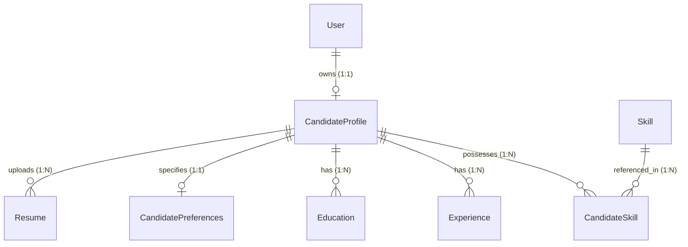

# JobWatch AI — Candidate Profiles, Experience & Authentication Specification (Phase 5)

## 1. Overview & System Role

Phase 5 introduces the user and candidate identity domain into **JobWatch AI**. It provides the persistence layer, domain modeling, and REST APIs to securely represent:

* User accounts & credentials (Argon2id password hashing)
* JWT session lifecycle
* Professional candidate identity & bio
* Normalized skills & proficiency levels
* Employment experience history
* Academic credentials & education
* Job search criteria & compensation preferences
* Deterministic profile completeness scoring

> **Crucial Architectural Boundary**: Phase 5 stores high-quality candidate data. It does **not** perform job matching, ranking, recommendations, embeddings, LLM reasoning, or notification dispatches. Those capabilities begin in **Phase 6: Matching Engine**.

---

## 2. Authentication & Security Foundation

### 1. Password Security
- Passwords are encrypted exclusively using **Argon2id** (`argon2-cffi`), the winner of the Password Hashing Competition.
- Parameterized with:
  - `time_cost=3`
  - `memory_cost=65536` (64 MB RAM)
  - `parallelism=4`
  - `hash_len=32`
- Passwords and password hashes are **strictly excluded** from API schemas, responses, debug logs, and exceptions.

### 2. JWT Session Management
- Signed using HMAC SHA-256 (`HS256`) via PyJWT.
- Token claims:
  - `sub`: User UUID
  - `iat`: UTC issuance timestamp
  - `exp`: UTC expiration timestamp (default: 60 minutes)
- Configured via environment:
  - `AUTH_ENABLED`: Feature flag enabling/disabling authentication checks.
  - `JWT_SECRET`: Signing secret (production startup fails if secret is weak or less than 32 characters).
  - `JWT_ALGORITHM`: Signing algorithm (`HS256`).
  - `ACCESS_TOKEN_EXPIRE_MINUTES`: Expiration window (default: 60 minutes).

### 3. Ownership & Authorization Isolation
- Profile and preference endpoints do not accept an arbitrary `user_id` in path or body.
- The active candidate identity is derived directly from the authenticated bearer token (`get_current_user` dependency).
- Cross-user access to another candidate's skills, experience, or education returns `403 Forbidden`.

---

## 3. Candidate Domain Model



### Entities

1. **User (`users`)**:
   - Manages identity, email uniqueness, authentication hash, active state, and login timestamps.
2. **CandidateProfile (`candidate_profiles`)**:
   - Core candidate identity (name, contact, location, headline, bio, years of experience, current role).
   - Enforces strictly 1:1 relationship with `User` via unique constraint on `user_id`.
3. **Skill (`skills`)**:
   - Canonical repository of normalized capabilities (e.g. `Python`, `FastAPI`, `Distributed Systems`).
   - Enforces unique canonical indexing on `normalized_name`.
4. **CandidateSkill (`candidate_skills`)**:
   - Associates candidate with a skill, proficiency level (`BEGINNER`, `INTERMEDIATE`, `ADVANCED`, `EXPERT`), and years of experience.
   - Enforces composite uniqueness on `(profile_id, skill_id)`.
5. **Experience (`experiences`)**:
   - Work history records with employer, role, location, start/end dates, current position flag, and descriptions.
   - Database check constraint enforces `end_date IS NULL OR end_date >= start_date`.
6. **Education (`educations`)**:
   - Academic history records with institution, degree, field of study, location, and dates.
   - Database check constraint enforces `start_date IS NULL OR end_date IS NULL OR end_date >= start_date`.
7. **CandidatePreferences (`candidate_preferences`)**:
   - Target criteria: desired job titles, preferred locations, workplace types (`REMOTE`, `HYBRID`, `ONSITE`), employment types (`FULL_TIME`, `CONTRACT`, etc.), salary expectations, experience ranges, and relocation willingness.
   - Database check constraint enforces `maximum_salary >= minimum_salary`.
8. **Resume (`resumes`)**:
   - File metadata (filename, content type, storage key, file size, upload timestamp).
   - Physical document storage and AI/semantic parsing are deferred to Phase 7/13.

---

## 4. Deterministic Profile Completeness Engine

Profile completeness is computed deterministically by `ProfileCompletenessService` using transparent weights:

| Section | Weight | Criteria |
| :--- | :---: | :--- |
| **Basic Identity** | 15% | First name, last name, and at least one location indicator (city, state, or country). |
| **Headline & Role** | 10% | Headline or current job title populated. |
| **Bio & Summary** | 10% | Non-empty professional bio. |
| **Skills** | 20% | At least 1 verified skill attached to the profile. |
| **Experience** | 20% | At least 1 work experience entry. |
| **Education** | 10% | At least 1 academic credential. |
| **Preferences** | 15% | Structured job preferences defined with target titles, locations, workplace types, or salary. |
| **Total** | **100%** | Score range: 0% to 100%. |

The service returns `profile_completion_percent`, a machine-readable list of `missing_sections`, and a boolean `breakdown` dictionary.

---

## 5. API Endpoints

### Authentication (`/api/v1/auth`)
- `POST /register`: Create new user account with Argon2id hash (`201 Created`).
- `POST /login`: Authenticate email and password, returning JWT bearer token (`200 OK`).
- `GET /me`: Return public identity for currently authenticated user (`200 OK`).

### Candidate Profile (`/api/v1/profile`)
- `GET /`: Get full profile with nested skills, experience, education, and preferences (`200 OK`).
- `POST /`: Explicitly initialize candidate profile (`201 Created`).
- `PUT /`: Update candidate profile attributes (`200 OK`).
- `GET /completeness`: Get completeness percentage and missing section checklist (`200 OK`).

### Skills (`/api/v1/profile/skills`)
- `GET /`: List all skills attached to current profile (`200 OK`).
- `POST /`: Attach new skill by name or UUID (`201 Created`).
- `PUT /{skill_assoc_id}`: Update proficiency or years of experience (`200 OK`).
- `DELETE /{skill_assoc_id}`: Remove skill from profile (`204 No Content`).

### Experience (`/api/v1/profile/experience`)
- `GET /`: List work history sorted chronologically (`200 OK`).
- `POST /`: Add new work experience entry (`201 Created`).
- `PUT /{exp_id}`: Update existing work experience entry (`200 OK`).
- `DELETE /{exp_id}`: Remove work experience entry (`204 No Content`).

### Education (`/api/v1/profile/education`)
- `GET /`: List education history sorted chronologically (`200 OK`).
- `POST /`: Add academic history entry (`201 Created`).
- `PUT /{edu_id}`: Update education entry (`200 OK`).
- `DELETE /{edu_id}`: Remove education entry (`204 No Content`).

### Job Preferences (`/api/v1/profile/preferences`)
- `GET /`: Retrieve candidate job search preferences (`200 OK`).
- `PUT /`: Create or update job search preferences and salary expectations (`200 OK`).

---

## 6. Contract for Phase 6 Matching Engine

When the **Phase 6 Matching Engine** is introduced, it will receive the normalized job posting and the structured candidate profile as inputs:

```text
    ┌──────────────────────┐             ┌──────────────────────┐
    │    Normalized Job    │             │   Candidate Profile  │
    │                      │             │                      │
    │ - Canonical Title    │             │ - Skills & Levels    │
    │ - Normalized Location│             │ - Experience History │
    │ - Workplace Type     │             │ - Education History  │
    │ - Employment Type    │             │ - Desired Roles      │
    │ - Description        │             │ - Location Prefs     │
    │ - Company Info       │             │ - Salary Target      │
    └──────────┬───────────┘             └──────────┬───────────┘
               │                                    │
               └─────────────────┬──────────────────┘
                                 ▼
                     ┌──────────────────────┐
                     │    Matching Engine   │
                     │      (Phase 6)       │
                     └──────────────────────┘
```

The matching engine will consume:
1. `candidate_profile.skills`: Matched against extracted job requirements.
2. `candidate_profile.experiences`: Matched for total years of experience, industry seniority, and relevant titles.
3. `candidate_profile.educations`: Evaluated against degree requirements.
4. `candidate_profile.preferences`:
   - `desired_titles`: Title fit scoring.
   - `preferred_locations`: Location distance and compatibility.
   - `workplace_types`: Workplace compatibility (`REMOTE`, `HYBRID`, `ONSITE`).
   - `employment_types`: Arrangement compatibility (`FULL_TIME`, `CONTRACT`, etc.).
   - `minimum_salary` / `maximum_salary`: Compensation alignment.
